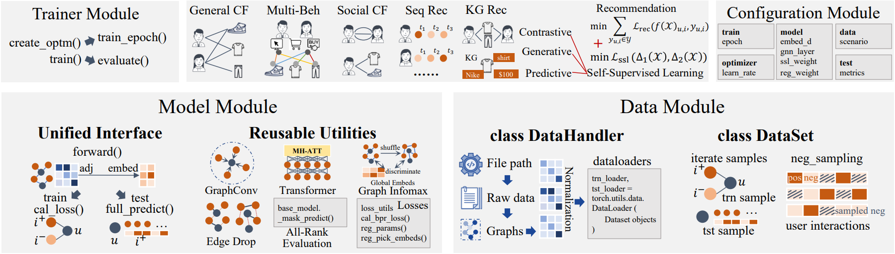

<p align="center">

</p>

#

<p align="center">
  <a href="https://github.com/HKUDS/SSLRec/blob/main/docs/User%20Guide.md">User Guide</a> •
  <a href="https://github.com/HKUDS/SSLRec/blob/main/docs/Models.md">Models</a> •
  <a href="https://github.com/HKUDS/SSLRec/blob/main/docs/Models.md">Datasets</a> 
</p>


**SSLRec** is a PyTorch-based open-source deep learning framework for recommender systems enhanced by self-supervised learning techniques. 
It's user-friendly and contains commonly-used datasets, code scripts for data processing, training, testing, evaluation, and state-of-the-art research models. 
**SSLRec** offers a vast array of utility functions and an easy-to-use interface that simplifies the development and evaluation of recommendation models.

<p align="center">

</p>

Our library includes various self-supervised learning recommendation algorithms, covering five major categories:

+ General Collaborative Filtering
+ Sequential Recommendation
+ Multi-Behavior Recommendation
+ Social Recommendation
+ Knowledge Graph-enhanced Recommendation

Our framework offers a unified training, validation, and testing process for each category, along with a standardized data preprocessing method using publicly available datasets. This makes it easy to reproduce various models and enables fair comparisons between different methods.

## Highlighted Features

+ 🧩**Flexible Modular Architecture.** The SSLRec library features a modular architecture that allows for effortless customization and combination of modules. This enables users to create personalized recommendation models that fit their specific needs and requirements.


+ 🌟**Diverse Recommendation Scenarios.** The SSLRec library is a versatile tool for researchers and practitioners who are interested in building effective recommendation models across diverse recommender system research lines.


+ 💡**Comprehensive State-of-the-Art Models.** Our SSLRec framework offers a wide range of SSL-enhanced recommendation models for various scenarios. Researchers can evaluate these models using advanced techniques and use them as a foundation for driving innovation in the field of recommender systems.


+ 📊**Unified Data Feeder and Standard Evaluation Protocols.** The SSLRec framework features a unified data feeder and standard evaluation protocols that enable easy loading and preprocessing of data from various sources and formats, while ensuring objective and fair evaluation of recommendation models.


+ 🛠️**Rich Utility Functions.** The SSLRec library provides a vast array of utility functions that simplify the development and evaluation of recommendation models. These functions incorporate common functionalities of recommender systems and self-supervised learning for graph operations, network architectures, and loss functions.


+ 🤖**Easy-to-Use Interface.** We offer a user-friendly interface that streamlines the training and evaluation of recommendation models. This allows researchers and practitioners to experiment with various models and configurations with ease and efficiency.

## SSLRec News
🔥 `2023-06-28`: Early stop is now feasible in the training strategy. (Check [Here](./update_log/2023-06-28.md) for more details)

## Implemented Models
We are committed to continuously adding new self-supervised models to the SSLRec framework to keep up with the latest developments in the field of recommender systems. Stay tuned for updates! 🔍

Here, we list the implemented models in abbrevation. For more detailed information, please refer to [Models](./docs/Models.md).

**General Collaborative Filtering**

+ [LightGCN](https://arxiv.org/pdf/2002.02126.pdf) (SIGIR'20), [SGL](https://arxiv.org/pdf/2010.10783.pdf) (SIGIR'21), [HCCF](https://arxiv.org/pdf/2204.12200.pdf) (SIGIR'22), [SimGCL](https://www.researchgate.net/profile/Junliang-Yu/publication/359788233_Are_Graph_Augmentations_Necessary_Simple_Graph_Contrastive_Learning_for_Recommendation/links/624e802ad726197cfd426f81/Are-Graph-Augmentations-Necessary-Simple-Graph-Contrastive-Learning-for-Recommendation.pdf?ref=https://githubhelp.com) (SIGIR'22), [NCL](https://arxiv.org/pdf/2202.06200.pdf) (WWW'22), [DirectAU](https://dl.acm.org/doi/pdf/10.1145/3534678.3539253) (KDD'22), [LightGCL](https://arxiv.org/pdf/2302.08191.pdf) (ICLR'23), [AutoCF](https://arxiv.org/pdf/2303.07797.pdf) (WWW'23), [DCCF](https://arxiv.org/pdf/2305.02759.pdf) (SIGIR'23), [GFormer](https://arxiv.org/pdf/2306.02330.pdf) (SIGIR'23)

**Sequential Recommendation**

+ [BERT4Rec](https://arxiv.org/pdf/1904.06690.pdf) (CIKM'19), [CL4SRec](https://arxiv.org/pdf/2010.14395.pdf) (ICDE'22), [DuoRec](https://arxiv.org/pdf/2110.05730.pdf) (WSDM'22), [ICLRec](https://arxiv.org/pdf/2202.02519.pdf) (WWW'22), [DCRec](https://arxiv.org/pdf/2303.11780.pdf) (WWW'23)

**Social Recommendation**

+ [MHCN](https://arxiv.org/pdf/2101.06448.pdf) (WWW'21), [KCGN](https://par.nsf.gov/servlets/purl/10220297) (AAAI'21), [SMIN](https://arxiv.org/pdf/2110.03958.pdf) (CIKM'21), [DSL](https://arxiv.org/abs/2305.12685) (IJCAI'23)

**Knowledge Graph-enhanced Recommendation**
+ [KGIN](https://dl.acm.org/doi/pdf/10.1145/3442381.3450133) (WWW'21), [KGCL](https://arxiv.org/pdf/2205.00976.pdf) (SIGIR'22), [KGRec](https://arxiv.org/pdf/2307.02759.pdf) (KDD'23)

**Multi-behavior Recommendation**
+ [MBGMN](https://arxiv.org/pdf/2110.03969.pdf) (SIGIR'21), [HMG-CR](https://arxiv.org/pdf/2109.02859.pdf) (ICDM'21), [S-MBRec](http://www.shichuan.org/doc/134.pdf) (IJCAI'22), [CML](https://arxiv.org/pdf/2202.08523.pdf) (WSDM'2022), [KMCLR](https://arxiv.org/pdf/2301.05403.pdf) (WSDM'23)

## Get Started

SSLRec is implemented under the following development environment:

+ python==3.10.4
+ numpy==1.22.3
+ torch==1.11.0
+ scipy==1.7.3

You can easily train LightGCN using our framework by running the following script:
```
python main.py --model LightGCN
```
This script will run the LightGCN model on the yelp datasets. 

The training configuration for LightGCN is saved in [lightgcn.yml](https://github.com/HKUDS/SSLRec/blob/main/config/modelconf/lightgcn.yml). You can modify the values in this file to achieve different training effects. Furthermore, if you're interested in trying out other implemented models, you can find a list of them under [Models](./docs/Models.md), and easily replace LightGCN with your model of choice.

For users who wish to gain a deeper understanding, we recommend reading our [User Guide](https://github.com/HKUDS/SSLRec/blob/main/docs/User%20Guide.md). This guide provides comprehensive explanations of SSLRec's concepts and usage, including:
+ SSLRec framework architecture design
+ Implementing your own model in SSLRec
+ Deploying your own datasets in SSLRec
+ Implementing your own training process in SSLRec
+ Automatic hyperparameter tuning in SSLRec

and so on.

## Improve Our Framework Together🤝
If you come across any bugs or have suggestions for improvement, please feel free to let us know by [filing an issue](https://github.com/HKUDS/SSLRec/issues). 

We warmly welcome contributions of all kinds, from bug fixes to new features and extensions. 🙌
